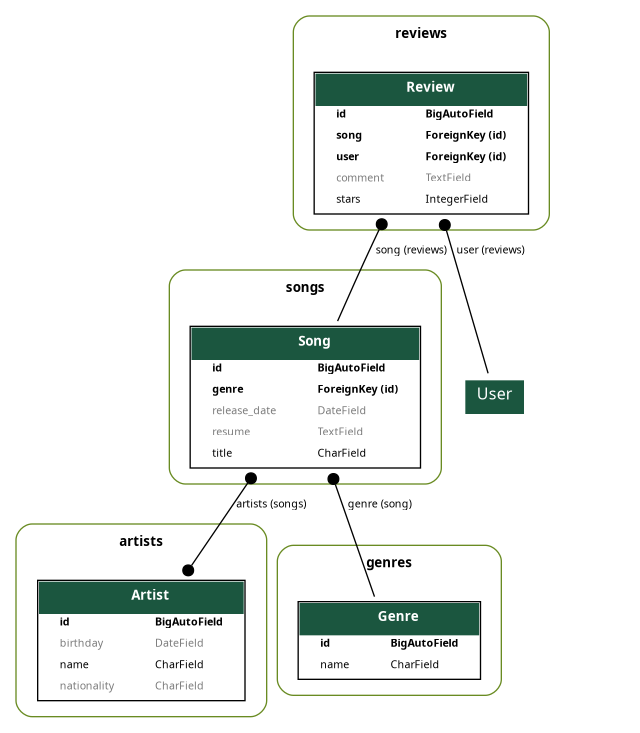

# song-vue

## Configuração recomendada de IDE

[VSCode](https://code.visualstudio.com/) + [Volar](https://marketplace.visualstudio.com/items?itemName=Vue.volar) (e desative o Vetur).

## Configuração do projeto

```sh
npm install
```

### Compilar e recarregar automaticamente para desenvolvimento

```sh
npm run dev
```

## Diagrama de Models do Projeto


